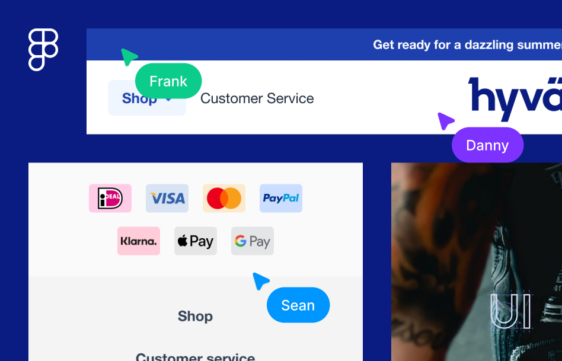

# Hyvä UI

## Official Resources

- Hyvä website: [hyva.io/hyva-ui.html →](https://www.hyva.io/hyva-ui.html)
- Hyvä Docs: [docs.hyva.io/hyva-ui-library/getting-started.html →](https://docs.hyva.io/hyva-ui-library/getting-started.html)
- Figma Community: [https://www.figma.com/@hyva  →](https://www.figma.com/@hyva)

## How to use this UI Library

You can find all available components in the [PDF overview](./assets/Hyva-UI-Component-Overview.pdf), or via Figma Community (Read the section below).

Each available component can be found in the [./components/](./components/) directory, which contains a dedicated README.md file in its folder with specific instructions.

For most components using them will require the template file to be copied into your Hyvä theme. Occasionally you'll also have to make some small additional changes to Tailwind CSS configuration, a CSS file, or Layout/Theme XML.
Make sure to read the Readme for each component closely to examine the requirements

Some components are built to be pasted directly into your Magento admin panel, using the [Hyvä CMS JIT compiler](https://docs.hyva.io/hyva-themes/cms/using-tailwind-classes-in-cms-content.html).

> **Note:** This is not a Magento Module  
>
> Even though you can download Hyvä UI via Private Packagist (if you are a Hyvä Theme licensee), this repository is not a Magento Module.

You can download it as a resource and then copy/paste individual components into your custom Hyvä Theme.

If you haven't already, first follow the [instructions to create your Child Theme](https://docs.hyva.io/hyva-themes/building-your-theme/index.html) via our documentation.

You shouldn't copy all the Hyvä UI components into your project's code base, as it would have some unwanted side-effects:
* More Tailwind CSS classes would be generated than needed, bloating your `styles.css` file.
* In the future, we might remove, rename or change components in a backward incompatible manner, breaking your site.

The idea is really to copy the templates into your project and adjust them as needed for a given Magento store.

## Using the Hyvä UI Figma file

The accompanying Figma file for Hyvä UI is a comprehensive resource that provides designers with a rich collection of UI components specifically designed to be used in conjunction with Hyvä Themes. Easily customize and adapt the components to suit your project requirements, streamlining the design process.

### Via Figma Community

You can now find the latest version of Hyvä UI on the Figma Community site: [https://www.figma.com/@hyva](https://www.figma.com/@hyva)

### Importing local Figma file

Instead of using Figma Community, you can also follow these steps to get up-and-running:
1. Download the [.fig file](./assets/Hyva-UI.fig) from the repository.
2. In Figma's file browser, select **Import file** or simply drag and drop the .fig file.

   [Read more about importing files to Figma →](https://help.figma.com/hc/en-us/articles/360041003114-Import-files-into-Figma)

### Getting started

The Hyvä UI Figma file makes use of robust features such as auto layout, styles, components and variations. Navigate to the **Getting started** page in the Figma file for tips, tricks and best practices.

## License

Hyvä Themes - https://hyva.io

Copyright © Hyvä Themes B.V 2020-present. All rights reserved.

This product is licensed per Magento install. Please see the LICENSE.md file in the root of this repository for more
information.
