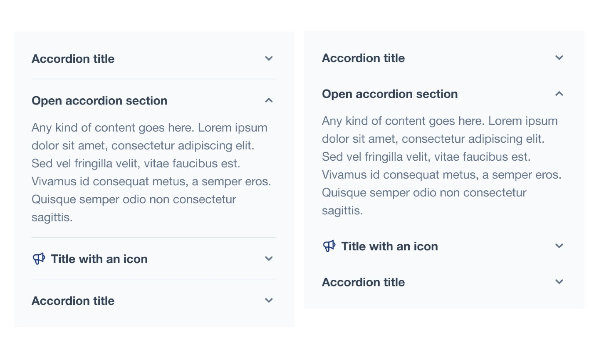

# Hyvä UI - accordion.A - simple

![cms-support]
[![License]](../../../LICENSE.md)
[![Hyva Supported Versions]](https://docs.hyva.io/hyva-ui-library/getting-started.html)
[![Tailwind Supported Versions]](https://tailwindcss.com/)
[![AlpineJS Supported Versions]](https://alpinejs.dev/)
[![Figma]](https://www.figma.com/@hyva)

Enhance your pages with our UI component, designed to simplify the creation of stunning and responsive layouts.

## Usage - CMS

1. Ensure you've installed [CMS Tailwind JIT] module in your project (see [Requirements](#requirements) below)
2. Copy the contents from `cms-content` into your CMS page or Block
3. Adjust the content and code to fit your own needs and save
4. Refresh the cache

## Usage - Template

1. Ensure you've installed [x-collapse] in your project (see [Requirements](#requirements) below)
2. Copy or merge the following files/folders into your theme:
   * `Magento_Theme/templates/elements/accordion`
3. Adjust the content and code to fit your own needs and save
4. Create your development or production bundle by running `npm run watch` or `npm run build-prod` in your
   theme's tailwind directory

### Configuration Options

This UI component offers customization options without modifying the corresponding phtml files.

To configure this UI component,
utilize the provided options as outlined in the `src/Magento_Theme/layout/cms_index_index.xml` file.

| Option Name       | Type    | Available Values   | Default | Description                                                              |
| ----------------- | ------- | ------------------ | ------- | ------------------------------------------------------------------------ |
| `child_template`  | string  | _Path to template_ |         | Specifies the child template to utilize                                  |
| `multiselectable` | boolean | true, false        | true    | Determines whether multiple accordion items can be open simultaneously   |
| `divider`         | boolean | true, false        | true    | Controls whether a divider should be displayed between accordion items   |
| `classes`         | string  | _CSS classes_      |         | Add here your own CSS classses or remove the default with an empty value |

Option <code>child_template</code> explained

You can switch between `collapse` and native HTML `details` elements by providing the `child_template`:
- `Magento_Theme::elements/accordion/item-collapse.phtml`
- `Magento_Theme::elements/accordion/item-details.phtml`

The HTML Details element offers the same functionality as the Collapse, but with the benefit that the HTML Details element works even if there is no Javascript loaded.

The only downside (at the moment) is that the HTML Details element closes with no animation.

#### Configuration Options `child_template`

| Option Name | Type    | Available Values | Default   | Description                                              |
| ----------- | ------- | ---------------- | --------- | -------------------------------------------------------- |
| `title`     | string  |                  | `Details` | Title to use                                             |
| `content`   | string  |                  |           | (Optional) use this argument to display the content _*1_ |
| `open`      | boolean | true, false      | true      | Controls whether accordion item is open by default       |
| `icon`      | string  | _Path to icon_   |           | Show icon before title _*2_                              |

> 1: `content` if a child block is used this value will be ignored
>
> 2: Path to the icon, for example: `heroicons/outline/speakerphone`,
> similar to the [Hyvä Docs on Custom svg icons](https://docs.hyva.io/hyva-themes/writing-code/working-with-view-models/svgicons.html#using-a-custom-svg-icon-set-in-your-theme) you can also use a custom icon

## Preview

## Requirements

### [CMS Tailwind JIT]

This component works with the [CMS Tailwind JIT] module to seamlessly integrate Tailwind CSS classes into your CMS content.

This module enables direct pasting of `cms-content` contents into CMS pages or blocks,
automatically generating the corresponding Tailwind CSS styles.

For installation instructions, refer to the [CMS Tailwind JIT] module's documentation.

### AlpineJS [x-collapse]

This component works with the Alpine plugin [x-collapse] and needs to be added when using this component.

In order to add the Alpine plugin [x-collapse], follow the following steps;

1. Copy `Magento_Theme/templates/page/js/plugins/collapse.phtml` into your template or Magento module.
2. Add or Copy the xml from `Magento_Theme/layout/default.xml` into your template or Magento module.

## Notes

There is no container around this element, assuming your theme already has some kind of container.

The font-family is not altered, unlike the font-sizes and colors. You can change those to fit your design.

---

The `x-defer` tag is only supported with Hyva theme module version 1.3.7 or higher.

If you're using an older version of the Hyva theme module, this tag will be ignored.

For about the [`x-defer` Apline plugin](https://docs.hyva.io/hyva-themes/view-utilities/alpine-defer-plugin.html) see our docs.

### Use as Plugin

If you plan to use the accordion on multiple pages and want to only have the JS function once on the page,
you can consider using the Hyvä Accordion as an Alpine Plugin.

To add the Hyvä Accordion Alpine plugin, follow these steps:

1. Copy `Magento_Theme/templates/page/js/plugins/hyva-accordion.phtml` into your template or Magento module.
2. Add the following XML `<block name="alpine-plugin-hyva-accordion" template="Magento_Theme::page/js/plugins/hyva-accordion.phtml"/>` to the `Magento_Theme/layout/default.xml`
3. Finally, remove the script tag from the `Magento_Theme/templates/elements/accordion/accordion.phtml` and/or `cms-content` templates.

## License

Hyvä Themes - https://hyva.io

Copyright © Hyvä Themes B.V 2020-present. All rights reserved.

This product is licensed per Magento install. Please see the LICENSE.md file in the root of this repository for more
information.

[cms-support]: https://img.shields.io/badge/cms_support-ffc803?style=for-the-badge
[License]: https://img.shields.io/badge/License-004d32?style=for-the-badge "Link to Hyvä License"
[Figma]: https://img.shields.io/badge/Figma-gray?style=for-the-badge&logo=Figma "Link to Figma"
[CMS Tailwind JIT]: https://docs.hyva.io/hyva-themes/cms/using-tailwind-classes-in-cms-content.html
[x-collapse]: https://alpinejs.dev/plugins/collapse

[Hyva Supported Versions]: https://img.shields.io/badge/Hyv%C3%A4-1.2,_1.3-0A23B9?style=for-the-badge&labelColor=0A144B "Hyvä Supported Versions"
[Tailwind Supported Versions]: https://img.shields.io/badge/Tailwind-3-06B6D4?style=for-the-badge&logo=TailwindCSS "Tailwind Supported Versions"
[AlpineJS Supported Versions]: https://img.shields.io/badge/AlpineJS-3-8BC0D0?style=for-the-badge&logo=alpine.js "AlpineJS Supported Versions"
