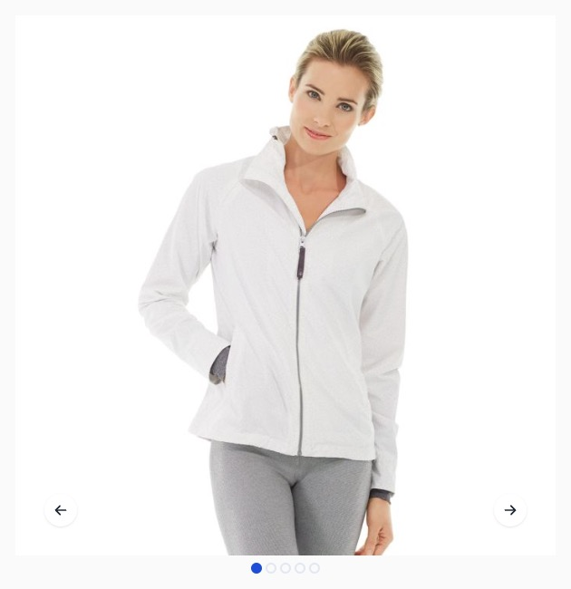

# Hyvä UI - gallery.D - SplideJS

[![License]](../../../LICENSE.md)
[![Hyva Supported Versions]](https://docs.hyva.io/hyva-ui-library/getting-started.html)
[![Tailwind Supported Versions]](https://tailwindcss.com/)
[![AlpineJS Supported Versions]](https://alpinejs.dev/)
[![Figma]](https://www.figma.com/@hyva)

Transform the Hyvä Product Gallery into something new with this UI Component,
that adds a lot of customization options,
so this UI Component can match your preferred look and feel with only a few teaks.

This Gallery uses SplideJS integration to show the Hyvä Product Gallery as a true slider.

## Usage - Template

1. Copy or merge the following files/folders into your theme:
   * `Magento_Catalog/templates/product/view/gallery.phtml`
   * `Magento_Theme/templates/page/js/plugins/splide-js.phtml`
   * `Magento_Catalog/layout/catalog_product_view.xml`
2. Adjust the content and code to fit your own needs and save
3. Create your development or production bundle by running `npm run watch` or `npm run build-prod` in your
   theme's tailwind directory

### Configuration Options

This UI component offers customization options without modifying the corresponding phtml files.

To configure this UI Component,
utilize the provided options below, with the default value set:

```xml
<var name="gallery">
    <var name="nav">dots</var> <!-- Gallery navigation style (false/dots) -->
    <var name="loop">true</var> <!-- Gallery navigation loop (true/false) -->
    <var name="caption">false</var> <!-- Display alt text as image title (true/false) -->
    <var name="allowfullscreen">true</var> <!-- Turn on/off fullscreen (true/false) -->
    <var name="navdir">horizontal</var> <!-- Sliding direction of navigation (horizontal/vertical) -->
    <!-- `start` & `end` are Hyva Only options -->
    <var name="arrows">true</var> <!-- Turn on/off arrows on the sides preview (start/end/true/false) -->
    <!-- Hyva Only options -->
    <var name="fullscreenicon">false</var> <!-- Turn on/off icon for allowfullscreen (true/false) -->
    <var name="autoplay">true</var> <!-- Turn on/off autoplay for videos (true/false) -->
</var>
```

To add any of these options, ensure that you only edit the section in your `etc/view.xml` under gallery:

```xml
<view xmlns:xsi="http://www.w3.org/2001/XMLSchema-instance" xsi:noNamespaceSchemaLocation="urn:magento:framework:Config/etc/view.xsd">
    <vars module="Magento_Catalog">
        <var name="gallery">
            <!-- Add the options here -->
        </var>
    </vars>
</view>
```

## Preview



## Notes

There is no container around this element, assuming your theme already has some kind of container.

The font-family is not altered, unlike the font-sizes and colors. You can change those to fit your design.

---

This UI Component is related to the gallery found in the Hyvä default theme as of version 1.3,
and it also works in versions equal and newer than 1.2.6 if you update the wrapping div with the following classes:

```html
class="order-1 w-full md:w-5/12 lg:w-1/2 md:h-auto"
```

instead of:

```html
class="w-full pt-6 md:pt-0 md:h-auto md:row-start-1 md:row-span-2 md:col-start-1"
```

---

This Gallery incorporates the modern aspect-ratio CSS property, ensuring seamless compatibility with older browsers without any functional issues. The only trade-off for older browser support is the loss of the attractive placeholder behavior in the dialog open state.

If you desire to retain this behavior for older browsers, please ensure you update your CSS using the [TailwindCSS plugin Aspect-ratio](https://github.com/tailwindlabs/tailwindcss-aspect-ratio) and adjust your HTML accordingly with the provided utility classes.

---

This version does not support thumbnails by default, but you can add them by following the [tutorial on the SplideJS Docs for the Thumbnail Carousel](https://splidejs.com/tutorials/thumbnail-carousel/).

Unfortunately, this version is not compatible with the vertical direction option, because SplideJS works with static height values that need to be synchronized with the main gallery to maintain a consistent ratio.

## License

Hyvä Themes - https://hyva.io

Copyright © Hyvä Themes B.V 2020-present. All rights reserved.

This product is licensed per Magento install. Please see the LICENSE.md file in the root of this repository for more
information.

[License]: https://img.shields.io/badge/License-004d32?style=for-the-badge "Link to Hyvä License"
[Figma]: https://img.shields.io/badge/Figma-gray?style=for-the-badge&logo=Figma "Link to Figma"

[Hyva Supported Versions]: https://img.shields.io/badge/Hyv%C3%A4-1.3-0A23B9?style=for-the-badge&labelColor=0A144B "Hyvä Supported Versions"
[Tailwind Supported Versions]: https://img.shields.io/badge/Tailwind-3-06B6D4?style=for-the-badge&logo=TailwindCSS "Tailwind Supported Versions"
[AlpineJS Supported Versions]: https://img.shields.io/badge/AlpineJS-3-8BC0D0?style=for-the-badge&logo=alpine.js "AlpineJS Supported Versions"
