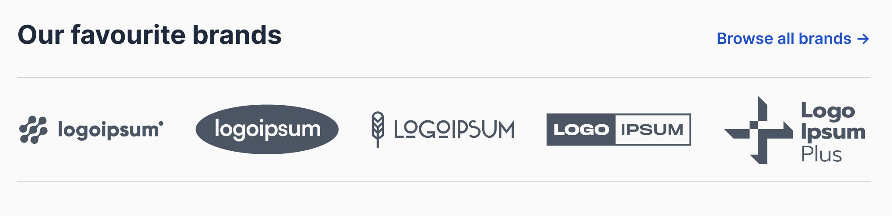

# Hyvä UI - slider.B - carousel

[![License]](../../../LICENSE.md)
[![Hyva Supported Versions]](https://docs.hyva.io/hyva-ui-library/getting-started.html)
[![Tailwind Supported Versions]](https://tailwindcss.com/)
[![AlpineJS Supported Versions]](https://alpinejs.dev/)
[![Figma]](https://www.figma.com/@hyva)

Add a new Hyvä element into your theme to show your brands on your pages.

## Usage - Template

1. Copy or merge the following files/folders into your theme:
   * `Magento_Theme/templates`
   * `Hyva_Theme/web/svg`
2. Replace the example `$items` with your own collection of slide data
3. Adjust the content and code to fit your own needs and save
4. Create your development or production bundle by running `npm run watch` or `npm run build-prod` in your
   theme's tailwind directory

### Configuration Options

This UI component offers customization options without modifying the corresponding phtml files.

To configure this UI component,
utilize the provided options as outlined in the `src/Magento_Theme/layout/cms_index_index.xml` file.

| Option Name  | Type    | Available Values | Default | Description                              |
| ------------ | ------- | ---------------- | ------- | ---------------------------------------- |
| `show_title` | boolean | true, false      | true    | Controls whether a title should be shown |

## Preview

## Notes

There is no container around this element, assuming your theme already has some kind of container.

The font-family is not altered, unlike the font-sizes and colors. You can change those to fit your design.

There are also some custom icons present for the social icons,
for more information about how to use custom SVG icons,
see our [documentation](https://docs.hyva.io/hyva-themes/writing-code/working-with-view-models/svgicons.html).

---

The `x-defer` tag is only supported with Hyva theme module version 1.3.7 or higher.

If you're using an older version of the Hyva theme module, this tag will be ignored.

For about the [`x-defer` Apline plugin](https://docs.hyva.io/hyva-themes/view-utilities/alpine-defer-plugin.html) see our docs.

## License

Hyvä Themes - https://hyva.io

Copyright © Hyvä Themes B.V 2020-present. All rights reserved.

This product is licensed per Magento install. Please see the LICENSE.md file in the root of this repository for more
information.

[License]: https://img.shields.io/badge/License-004d32?style=for-the-badge "Link to Hyvä License"
[Figma]: https://img.shields.io/badge/Figma-gray?style=for-the-badge&logo=Figma "Link to Figma"

[Hyva Supported Versions]: https://img.shields.io/badge/Hyv%C3%A4-1.2,_1.3-0A23B9?style=for-the-badge&labelColor=0A144B "Hyvä Supported Versions"
[Tailwind Supported Versions]: https://img.shields.io/badge/Tailwind-3-06B6D4?style=for-the-badge&logo=TailwindCSS "Tailwind Supported Versions"
[AlpineJS Supported Versions]: https://img.shields.io/badge/AlpineJS-3-8BC0D0?style=for-the-badge&logo=alpine.js "AlpineJS Supported Versions"
