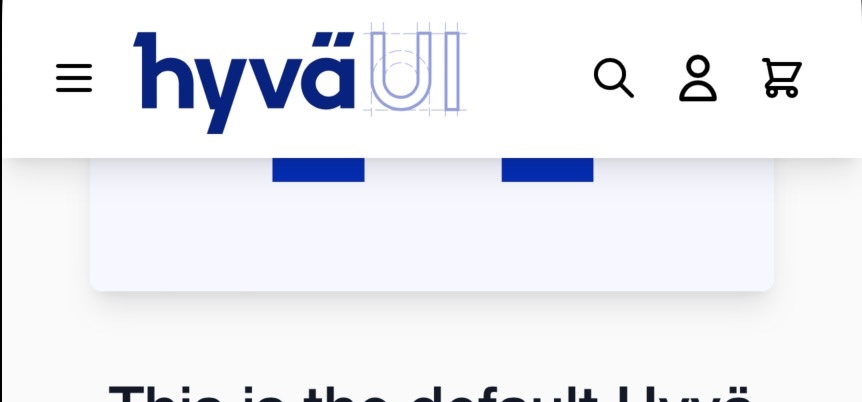

# Hyvä UI - sticky-header.a - classic

[![License]](../../../LICENSE.md)
[![Hyva Supported Versions]](https://docs.hyva.io/hyva-ui-library/getting-started.html)
[![Figma]](https://www.figma.com/@hyva)

Enhance your Hyvä storefront with a sticky header that remains fixed at the top of the page, even when scrolling.

This provides a seamless user experience and ensures easy navigation throughout your site.

## Usage - Template

1. Copy or merge the following files/folders into your theme:
   * `Magento_Theme/templates/page/js`
   * `Magento_Theme/layout/default.xml`
2. Adjust the content and code to fit your own needs and save
3. Create your development or production bundle by running `npm run watch` or `npm run build-prod` in your
   theme's tailwind directory

### Configuration Options

This UI component offers customization options without modifying the corresponding phtml files.

To configure this UI component,
utilize the provided options as outlined in the `src/Magento_Theme/layout/default.xml` file.

| Option Name                    | Type    | Available Values | Default | Description                                                  |
| ------------------------------ | ------- | ---------------- | ------- | ------------------------------------------------------------ |
| `hide_on_scroll_down`          | boolean | true, false      | true    | Hide the sticky header when scrolling down                   |
| `scroll_offset`                | number  | _Number Range_   | 100     | Offset before the helper reflects the scroll direction       |
| `enable_css_only_sticky_style` | boolean | true, false      | false   | Use a CSS only solution, see [notes](#notes) for limitations |

## Preview



## Notes

This component is fully standalone, meaning it doesn't rely on TailwindCSS or AlpineJS. This makes it compatible with any Hyvä installation.

---

The CSS only sticky style solution will not work for Safari and Firefox,
as a result, the sticky header functionality will work without any of the extra styles in these browsers.

For support of this feature see the [CSS animation timeline page on caniuse.com](https://caniuse.com/mdn-css_properties_animation-timeline).

---

If you use disable the `hide_on_scroll_down` make sure to update any sticky element, like the pages message with the following code:

```diff
/* File: web/tailwind/components/messages.css */

.page.messages {
--  @apply sticky top-0 z-20;
++  @apply sticky top-[var(--page-header-height)] z-20;
```

The CSS variable `--page-header-height` is only available when using Hyvä UI headers,
so if your using a diffrent header, please refer to the Hyvä UI headers on how to add this to your own header.

## License

Hyvä Themes - https://hyva.io

Copyright © Hyvä Themes B.V 2020-present. All rights reserved.

This product is licensed per Magento install. Please see the LICENSE.md file in the root of this repository for more
information.

[License]: https://img.shields.io/badge/License-004d32?style=for-the-badge "Link to Hyvä License"
[Figma]: https://img.shields.io/badge/Figma-gray?style=for-the-badge&logo=Figma "Link to Figma"

[Hyva Supported Versions]: https://img.shields.io/badge/Hyv%C3%A4-all-0A23B9?style=for-the-badge&labelColor=0A144B "Hyvä Supported Versions"
